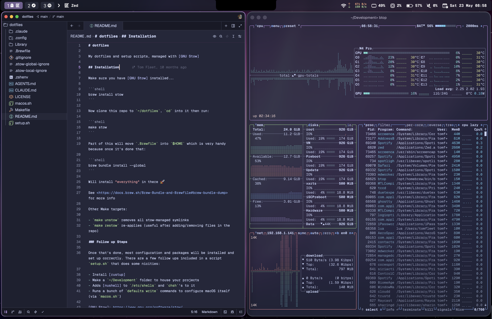

# dotfiles

My dotfiles and setup scripts for macOS, managed with [GNU Stow]



## Installation

Make sure you have [GNU Stow] installed...

```shell
brew install stow
```

Now clone this repo to `~/dotfiles`, `cd` into it then run:

```shell
make stow
```

Part of this will move `.Brewfile` into `$HOME` which is very handy because once it's done that:

```shell
brew bundle install --global
```

Will install *everything* in there 🚀

See <https://docs.brew.sh/Brew-Bundle-and-Brewfile#brew-bundle-dump> for more info

Other Make targets:

- `make unstow` removes all stow-managed symlinks
- `make restow` re-applies (useful after adding/removing files in the repo)

### Follow up Steps

Once that's done, most configuration and packages will be installed and set up correctly. There are a few follow ups included in a script `setup.sh` that does some nicities:

- Install [rustup]
- Make a `~/Development` folder to house your projects
- Adds [nushell] to `/etc/shells` and `chsh`'s to it
- Runs a bunch of `defaults write` commands to configure macOS itself (via `macos.sh`)

[GNU Stow]: https://www.gnu.org/software/stow/
[rustup]: https://rustup.rs
[nushell]: https://www.nushell.sh
